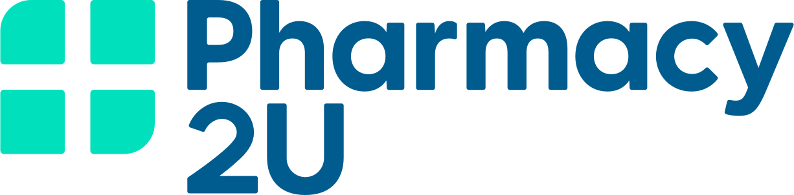

  
  <h1 align="center">Prescription Refill Risk</h1>
  
Predicting late prescription refills using machine learning

  
  
  
  
  
  
  
  

  <strong>Challenge A</strong> &mdash; Data & AI Hackathon, University of Leeds, 30&ndash;31 March 2026 
  Sponsored by <a href="https://www.pharmacy2u.co.uk/">Pharmacy2U</a>

---

## Team

| Name | GitHub |
|------|--------|
| Xin Ci Wong | [@X-ksana](https://github.com/X-ksana) |
| Arpita Saggar | [@arpita2512](https://github.com/arpita2512) |
| Omar Choudhry | [@omariosc](https://github.com/omariosc) |
