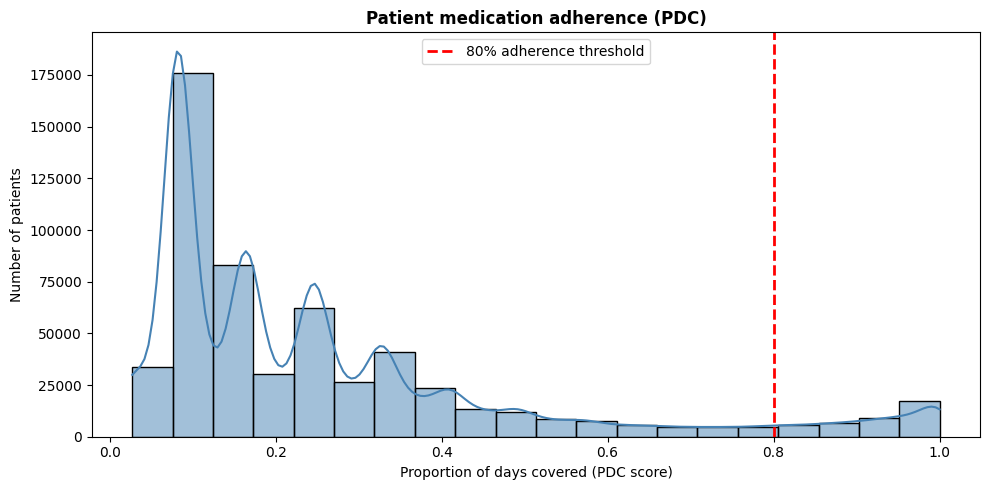
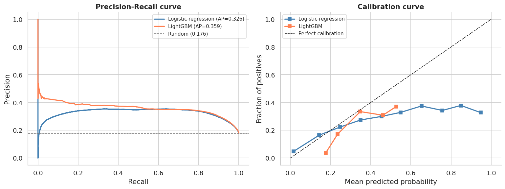
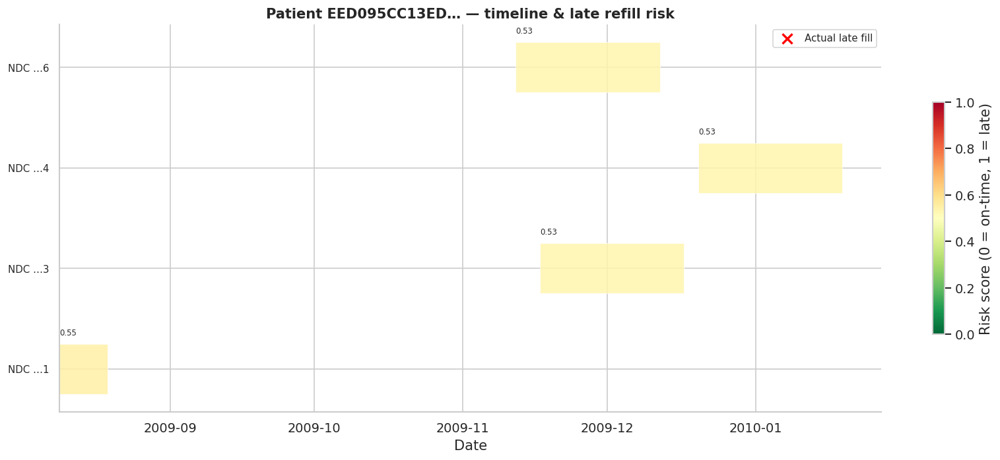

# Challenge A — Late Refill Risk Prediction

**Pharmacy2U × University of Leeds Data & AI Hackathon 2026**  
Track 1: Prescription Refill Risk & Responsible Recommendations

---

## Overview

This notebook builds a **patient-drug level late refill risk model** using synthetic CMS Medicare Part D prescription claims data (DE-SynPUF). For each prescription fill, the model predicts the probability that the patient will refill late on their *next* fill and outputs a calibrated risk score, a binary flag, and a four-tier risk label.

> **Important:** This is a modelling and product-thinking exercise on synthetic claims data. Outputs are not clinical advice and should not be interpreted as such.

---

## Repository Structure

```
├── data_cleaning_clean.ipynb     # Data cleaning & feature engineering pipeline
├── eda_with_late_refillers.ipynb # Exploratory data analysis incl. late refiller section
├── challenge_a_model.ipynb       # Predictive model for Challenge A : to combine with Arpita
├── full_df_with_msr.parquet      # Cleaned dataset with measurement periods (input)
├── merged_df.parquet             # Cleaned merged dataset (input)
├── test_scored.parquet           # Output: test set with risk scores
├── model_lgbm.pkl                # Output: trained LightGBM model
├── model_baseline.pkl            # Output: trained logistic regression baseline
├── feature_cols.pkl              # Output: ordered feature column list
└── model_config.pkl              # Output: threshold, grace window, split date
```

---

## How to Run

### Requirements

```bash
pip install lightgbm shap scikit-learn pandas numpy matplotlib seaborn joblib
```

### Steps

1. Run `data_cleaning_clean.ipynb` first to produce `merged_df.parquet` and `full_df_with_msr.parquet`.
2. Open `challenge_a_model.ipynb` in Google Colab or Jupyter.
3. Run all cells top to bottom. No manual inputs are required.
4. Outputs are saved to the working directory on completion.

### Key configuration constants (top of notebook)

| Constant | Default | Description |
|---|---|---|
| `GRACE_DAYS` | `14` | Days after supply runs out before a refill is considered late |
| `RANDOM_SEED` | `42` | Global random seed for reproducibility |
| `SPLIT_DATE` | `2009-07-01` | Temporal train/test boundary |

---

## Dataset

**Source:** CMS DE-SynPUF Prescription Drug Events (PDE), Sample 1, 2008–2010  
**Input file:** `merged_df.parquet` 

The dataset is fully synthetic — NDC codes are randomly generated and do not correspond to real drug products. Drug metadata (ingredient, route, strength) is joined from a separate lookup table to enable grouping refill sequences by ingredient rather than NDC.

---
## Data Cleaning

**Source files:** CMS DE-SynPUF Prescription Drug Events (5.5M rows) + 2010 Beneficiary Summary (112K patients), both loaded with optimised dtypes to reduce memory.

**PDE cleaning steps:**
- `SRVC_DT` parsed from integer `YYYYMMDD` to datetime
- Records with null patient ID or service date dropped
- `PROD_SRVC_ID == 'OTHER'` removed (non-drug placeholder codes)
- `DAYS_SUPLY_NUM` values ≤ 0 or ≥ 365 removed as invalid; remaining nulls imputed with the median and flagged with `days_supply_missing_flag`
- Patients with fewer than 2 prescription records excluded (no refill sequence can be computed)
- Sorted chronologically by patient and date

**Beneficiary merge:** inner join on `DESYNPUF_ID`. Annual reimbursement and coverage columns (`MEDREIMB_*`, `BENRES_*`, `PPPYMT_*`, `PLAN_CVRG_MOS_NUM`, etc.) dropped as **data leakage** — they are year-level aggregates that would encode future information into per-claim features. Date columns (`BENE_BIRTH_DT`, `BENE_DEATH_DT`) parsed from integer format. 

**Disease flag recoding:** Raw SP_ columns use 1 = condition present, 2 = absent. Recoded to 1/0 as `int8` before any categorical conversion, avoiding the pandas FutureWarning caused by replacing values in category dtype columns.

---

## Feature Engineering

### Patient features
| Feature | Description |
|---|---|
| `Age` | Age at prescription date: `(SRVC_DT − BENE_BIRTH_DT).days // 365` |
| `has_death_record` | 1 if `BENE_DEATH_DT` is not null |

### Comorbidity features
| Feature | Description |
|---|---|
| `comorbidity_count` | Sum of all 11 SP_ binary flags per patient |
| `cat_heart` | 1 if any of CHF, ischaemic heart disease, or stroke/TIA is present |
| `cat_kidney_metabolic` | 1 if chronic kidney disease or diabetes is present |
| `cat_neuro_mental` | 1 if Alzheimer's/dementia or depression is present |
| `cat_musculoskeletal` | 1 if osteoporosis or RA/OA is present |
| `is_frail` | 1 if `comorbidity_count ≥ 3` — proxy for high clinical complexity |
| `flag_behavioral_complication` | 1 if depression is present alongside at least one physical condition |
| `flag_triad_risk` | 1 if diabetes + chronic kidney disease + (CHF or IHD) — the highest-risk metabolic-renal-cardiac combination |

### Financial features
| Feature | Description |
|---|---|
| `insurance_benefit_amt` | `TOT_RX_CST_AMT − PTNT_PAY_AMT`, clipped at 0 |
| `oop_ratio` | `PTNT_PAY_AMT / TOT_RX_CST_AMT`, 0 when total cost is zero; clipped to [0, 1] |
| `log_ptnt_pay` | `log1p(PTNT_PAY_AMT)` — reduces right skew for model training |
| `log_tot_cst` | `log1p(TOT_RX_CST_AMT)` |
| `flag_high_financial_barrier` | 1 if `oop_ratio > 0.5` — patient pays more than half the drug cost |

### Target variable — `MISSES` / `is_late`
The late-refill label is built by grouping on `DESYNPUF_ID + INGREDIENT` rather than NDC code. The reason: DE-SynPUF assigns synthetic, random NDC codes so the same drug can appear under different codes across fills — grouping by NDC produces only ~3K evaluable pairs from 5.3M rows. Grouping by ingredient (from the drug metadata join) reconstructs the true refill sequence.

```
RUN_OUT_DATE = SRVC_DT + DAYS_SUPLY_NUM
gap_days     = next_fill SRVC_DT − RUN_OUT_DATE
MISSES       = "Late"    if gap_days > 14
             = "In time" if gap_days ≤ 14
             = "NA"      if no subsequent fill exists (censored)
is_late      = 1 / 0 (NA rows excluded from modelling)
```

A 14-day grace window is used — fills up to a week after supply runs out are considered on time, which accounts for typical real-world dispensing delays and prescription processing times. The grace window is configurable; the EDA includes a sensitivity analysis across 0, 3, 7, 14, and 30 days.

### PDC measurement periods

```
# Need to install additional package
!pip install pdcscore -q

```

For proportion of days covered scoring, a measurement window is defined per patient-ingredient pair: start = first fill date, end = min(start + 365 days, death date). The death date truncation handles competing risk — patients who died before their 365-day window would otherwise appear artificially non-adherent. A quality flag `flag_prescription_too_late_after_death` marks any fill recorded more than 14 days after the patient's death date, which in real data indicates a data integrity issue.




## Target Variable — `is_late`

A fill is labelled **late** if the next fill for the same patient-ingredient pair occurs more than `GRACE_DAYS` days after the supply was expected to run out.

```
run_out_dt  = SRVC_DT + DAYS_SUPLY_NUM
gap_days    = next_fill_SRVC_DT − run_out_dt
is_late     = 1  if gap_days > 14
            = 0  if gap_days ≤ 14  (on time or stockpiling)
            = NA if no subsequent fill exists (last fill — censored, excluded)
```

**Why group by `INGREDIENT` and not `PROD_SRVC_ID` (NDC)?**  
DE-SynPUF assigns random synthetic NDCs, so the same drug often appears under different codes across consecutive fills for the same patient. Grouping by NDC yields fewer than 3,200 evaluable pairs from 5.3M rows. Grouping by ingredient reconstructs the true refill sequence and produces a meaningful dataset for modelling.

**Grace window rationale:** A 14-day grace window accounts for realistic dispensing delays, prescription processing, and minor scheduling variation. The EDA notebook includes a sensitivity analysis across 0, 3, 7, 14, and 30 days.

---

## Feature Engineering

All features are constructed using **only information available at the time of the current fill** — no future data leaks into the feature set. Lag and rolling features use `.shift(1)` to look backwards only.

### Dispensing features

| Feature | Description |
|---|---|
| `DAYS_SUPLY_NUM` | Days of supply dispensed at this fill |
| `QTY_DSPNSD_NUM` | Units dispensed at this fill |
| `fill_number` | Sequential fill count per patient-drug pair (1 = first fill) |

### Refill cadence history

These features capture the patient's past behaviour for the same drug. All use `shift(1)` so only prior fills inform the prediction.

| Feature | Description |
|---|---|
| `prev_gap_days` | Gap days at the *previous* fill (positive = was late, negative = was early) |
| `prev_days_supply` | Days supply dispensed at the previous fill |
| `rolling_gap_mean` | Rolling mean of gap days over the last 3 fills |
| `rolling_gap_std` | Rolling std of gap days over the last 3 fills — captures cadence irregularity |
| `prev_was_early` | 1 if the previous fill had `gap_days < −7` (stockpiling behaviour) |

Lag features are imputed with `0` for first fills (no prior history). This is conservative — a zero gap assumes on-time behaviour at baseline.

### Cost features

| Feature | Description |
|---|---|
| `log_tot_cst` | `log1p(TOT_RX_CST_AMT)` — log-transformed total drug cost |
| `log_ptnt_pay` | `log1p(PTNT_PAY_AMT)` — log-transformed patient out-of-pocket payment |
| `oop_ratio` | `PTNT_PAY_AMT / TOT_RX_CST_AMT` — proportion of cost borne by patient, clipped to [0, 1] |
| `prev_tot_cost` | Total drug cost at the previous fill |
| `prev_ptnt_pay` | Patient payment at the previous fill |

Log transforms are applied to reduce right skew from high-cost outlier medications. The `oop_ratio` captures financial burden independently of absolute cost.

### Patient demographics

| Feature | Description |
|---|---|
| `Age` | Age at prescription date: `(SRVC_DT − BENE_BIRTH_DT).days // 365` |
| `BENE_SEX_IDENT_CD` | Sex code, label-encoded (1 = Male, 2 = Female) |
| `BENE_RACE_CD` | Race code, label-encoded |

### Comorbidity features

Derived in the cleaning pipeline from the 11 SP_ chronic condition flags (recoded from 1/2 to 1/0).

| Feature | Description |
|---|---|
| `comorbidity_count` | Total number of active chronic conditions (0–11) |
| `is_frail` | 1 if `comorbidity_count ≥ 3` — proxy for high clinical complexity |
| `cat_heart` | 1 if CHF, ischaemic heart disease, or stroke/TIA is present |
| `cat_kidney_metabolic` | 1 if chronic kidney disease or diabetes is present |
| `cat_neuro_mental` | 1 if Alzheimer's/dementia or depression is present |
| `cat_musculoskeletal` | 1 if osteoporosis or RA/OA is present |
| `flag_behavioral_complication` | 1 if depression is present alongside at least one physical condition |
| `flag_triad_risk` | 1 if diabetes + kidney disease + (CHF or IHD) — highest-risk metabolic-renal-cardiac triad |

### Polypharmacy & temporal features

| Feature | Description |
|---|---|
| `n_unique_drugs` | Total distinct drugs the patient is currently filling — proxy for medication burden |
| `fill_month` | Calendar month of the fill (1–12) — captures seasonal patterns |
| `is_year_end_q` | 1 if fill occurs in Q4 (Oct–Dec) — captures year-end insurance/deductible reset effects |

### Data quality

| Feature | Description |
|---|---|
| `days_supply_missing_flag` | 1 if `DAYS_SUPLY_NUM` was originally null and imputed with the median |

---

## Modelling

### Train / test split

A **temporal split** is used — all fills before `2009-07--01` form the training set; fills on or after form the test set. This mirrors real deployment: a model trained on historical data is applied to future fills. Random splits are explicitly avoided to prevent data leakage through patient history features.

### Models

**Baseline — Logistic Regression**  
Trained with `class_weight='balanced'` to handle class imbalance, with `StandardScaler` in a sklearn `Pipeline`. Provides a lower bound on performance that any useful model must beat.

**Primary — LightGBM**  
Gradient boosted trees with:
- `scale_pos_weight` set to the ratio of negative to positive examples to handle class imbalance
- Early stopping (50 rounds patience) evaluated on the test set
- `subsample=0.8` and `colsample_bytree=0.8` for regularisation
- `min_child_samples=50` to prevent overfitting on small leaf nodes

### Evaluation metrics

| Metric | Why it's used |
|---|---|
| **PR-AUC** (primary) | Precision-Recall AUC is appropriate for imbalanced classification — it focuses on how well the model identifies the minority (late) class without being inflated by the majority (on-time) class |
| ROC-AUC | Complementary ranking metric; less informative under class imbalance but useful for comparison |
| Brier score | Measures calibration quality — whether predicted probabilities match actual late rates |
| Calibration curve | Visual check that risk scores are reliable as probabilities, not just rankings |

**Threshold tuning:** the operating threshold is chosen to maximise F1-score on the test set, balancing precision (flagging correctly) and recall (catching most late refills).





### Risk tiers

Scores are bucketed into four tiers for operational use:

| Tier | Score range | Suggested action |
|---|---|---|
| Low | 0.00 – 0.25 | Routine monitoring |
| Medium | 0.25 – 0.50 | Soft reminder |
| High | 0.50 – 0.75 | Proactive outreach |
| Very High | 0.75 – 1.00 | Priority intervention |

---

## Explainability

**SHAP (SHapley Additive exPlanations)** is used via `shap.TreeExplainer` on a 5,000-row sample of the test set.

Three views are produced:

- **Bar chart** — global feature importance ranked by mean absolute SHAP value
- **Beeswarm plot** — direction and spread of each feature's effect across all predictions (red = increases late risk, blue = decreases it)
- **Dependence plots** — how the four most important features relate to their SHAP values, with colour encoding showing interaction effects
- **Waterfall plot** — single-prediction explanation showing exactly which features pushed a specific fill's risk score above or below the baseline


---

## Demo Output

The `patient_timeline()` function produces a colour-coded Gantt chart for any patient in the test set:

- Each row is one drug (up to 4 shown)
- Each bar spans the fill date to the run-out date, coloured green (low risk) to red (high risk)
- The per-fill risk score is printed above each bar
- Red ✗ marks are placed at the run-out date of any fill that was actually late

A scrollable styled table beneath the chart shows the fill dates, gap days, risk score, and risk tier for each prescription.



---

## Outputs

| File | Description |
|---|---|
| `test_scored.parquet` | Test set rows with `risk_score`, `risk_flag`, `risk_tier` columns |
| `model_lgbm.pkl` | Trained LightGBM model (load with `joblib.load`) |
| `model_baseline.pkl` | Trained logistic regression pipeline |
| `feature_cols.pkl` | Ordered list of feature column names |
| `model_config.pkl` | Dict with `threshold`, `grace_days`, `split_date` |

---

## Caveats

- **Synthetic data:** DE-SynPUF NDC codes are randomly generated. Drug-level patterns (e.g. late rate by ingredient) reflect the simulation distribution, not real-world adherence behaviour. Results should not be generalised to real patients.
- **Not clinical advice:** This is a modelling exercise. Risk scores are statistical predictions, not medical recommendations.
- **Beneficiary file is 2010-only:** The beneficiary summary used here is the 2010 file only. Patients who appear only in 2008–2009 PDE records but not in the 2010 beneficiary file are dropped by the inner join in the cleaning pipeline.
- **Censoring:** Last fills per patient-ingredient are excluded from modelling since no next fill exists to evaluate. In a production system, survival analysis (e.g. Cox regression) would handle censoring more rigorously.


